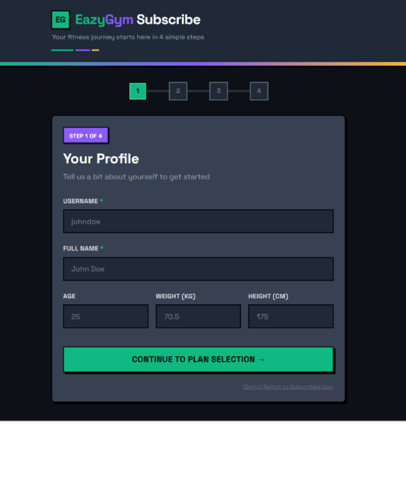
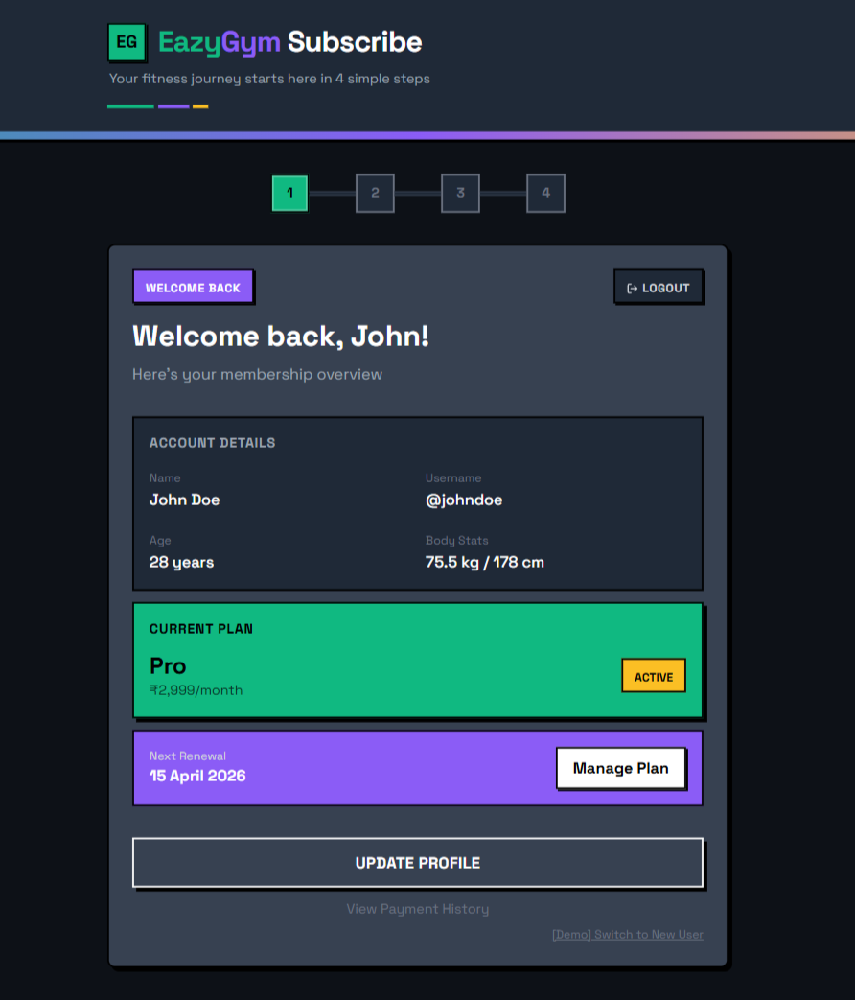
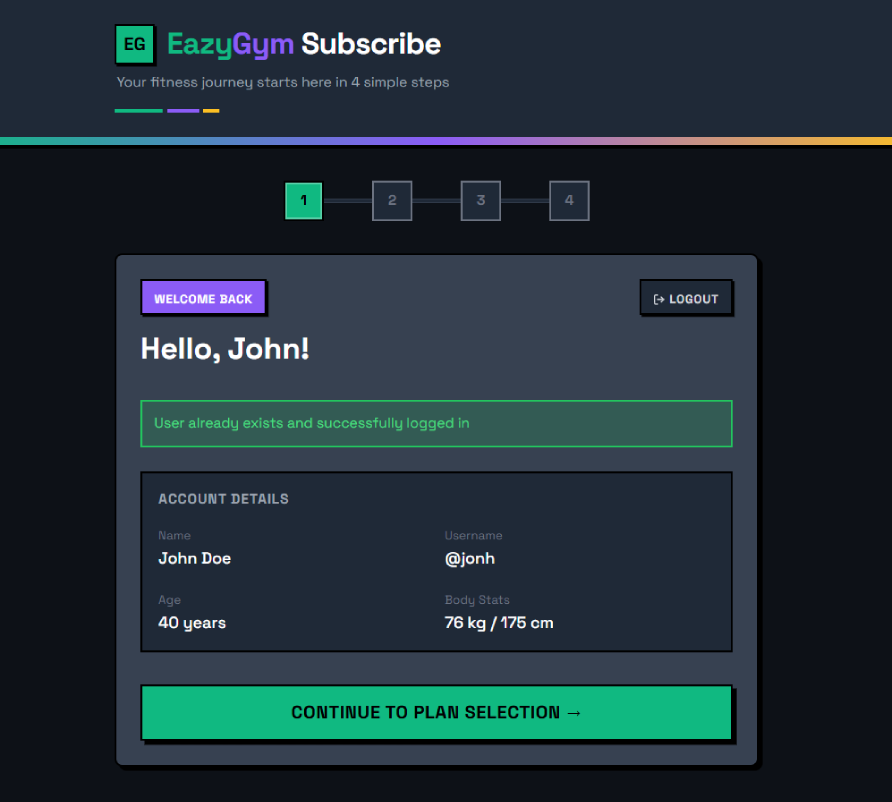
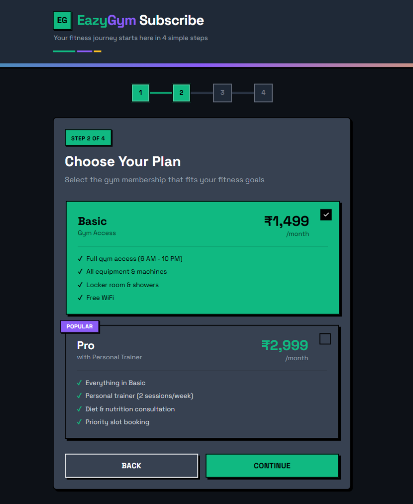
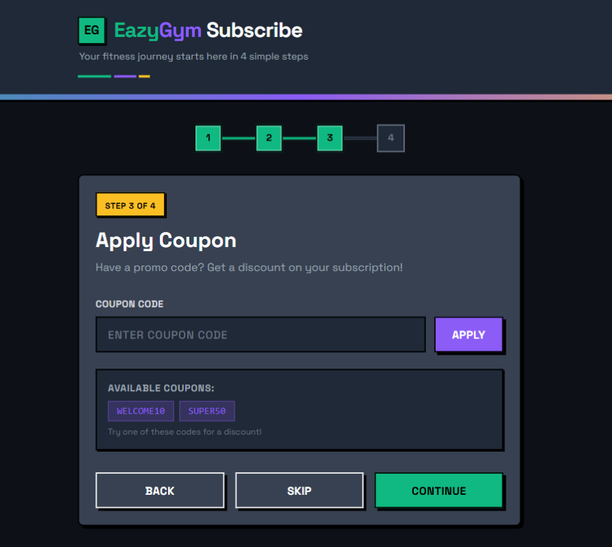
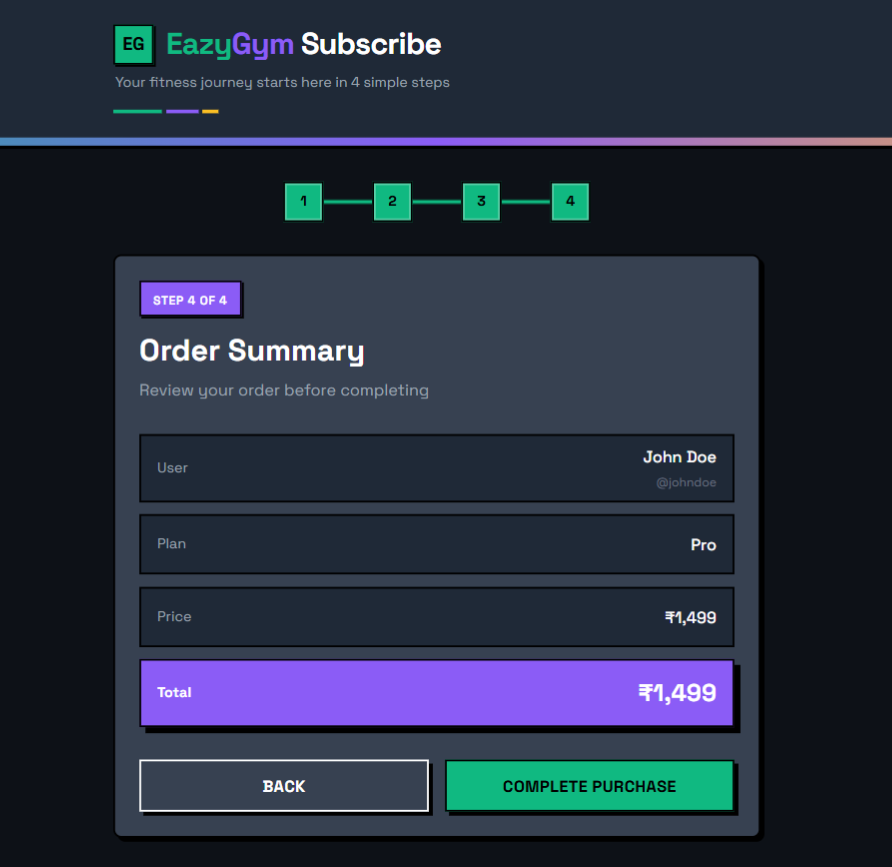

# Payment Flow - Developer Evaluation

A subscription payment flow boilerplate for evaluating developers. This is a **mock project** simulating a gym membership signup system.

## Quick Start

```bash
# Full setup (recommended for first time)
bun run setup

# Start development server
bun run dev
```

This will start:
- **Frontend**: http://localhost:3000
- **Backend**: http://localhost:3001

## Documentation

- **[GETTING_STARTED.md](./GETTING_STARTED.md)** - Project setup, database schema, API reference
- **[TASKS.md](./TASKS.md)** - What you need to implement (start here)

## Screenshots

### Profile Page




### Plan Selection


### Coupon Page


### Summary Page


## Tech Stack

- **Frontend**: React + Vite + Tailwind CSS
- **Backend**: Express + Bun + SQLite
